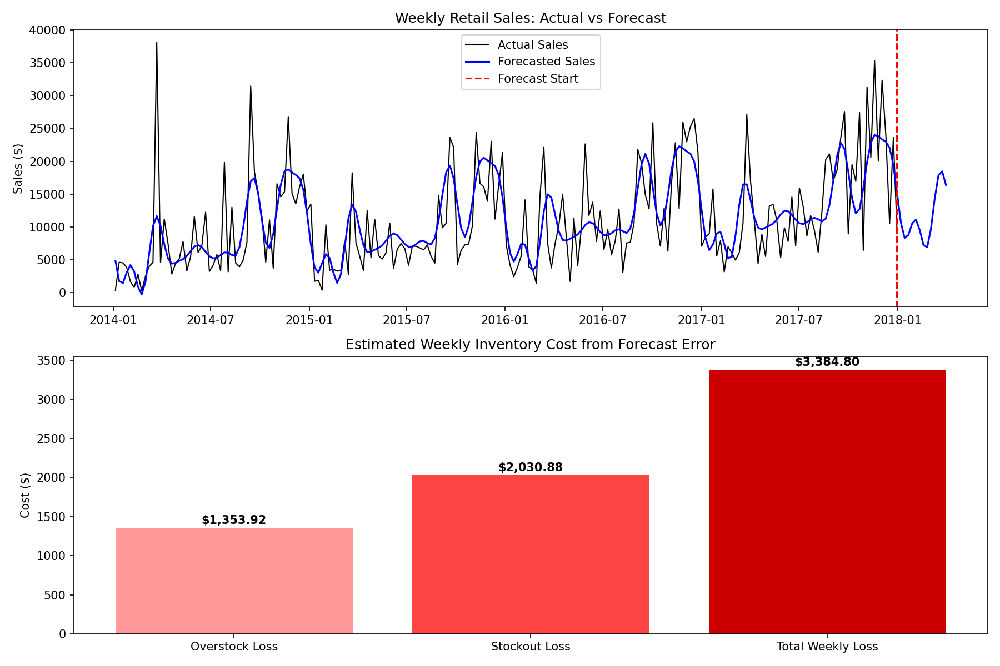

# Retail Demand Forecasting & Inventory Cost Optimization

## Approach
1. Aggregated 9,994 transactions into weekly sales series (2014–2017)
2. Trained Facebook Prophet with yearly seasonality — capturing holiday and seasonal demand spikes
3. Evaluated model accuracy (MAPE 61.59%) and benchmarked against naive baseline
4. Translated forecast error into overstock/stockout cost using industry-standard holding (20%) and shortage (30%) cost assumptions
5. Derived data-driven reorder threshold with 50% safety stock buffer

## Key Visualizations

## Business Insight
Most forecasting projects stop at MAPE. This one doesn't.
A 61.59% weekly forecast error isn't just a number — it's **$176,009 in avoidable annual inventory losses**. The reorder threshold of $17,660/week gives procurement a concrete, model-backed rule to act on instead of guessing.

## What I'd Improve With More Time
- Category-level forecasting (Furniture vs Office Supplies behave differently)
- External signals: promotions, holidays, economic indicators
- Automated reorder alert system via API

## Tech Stack
Python, Facebook Prophet, Pandas, NumPy, Matplotlib, Jupyter Notebook

## Project Structure
retail-demand-forecasting/
├── data/
│   └── Sample - Superstore.csv    # 4 years of retail transaction data
├── demand_forecasting.ipynb        # Full analysis, modelling, business translation
├── forecast_business_summary.png  # Actual vs forecast + cost impact visualization
└── README.md
